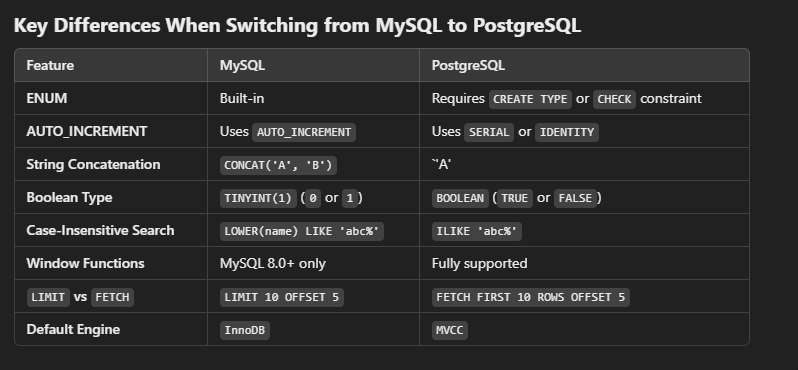

# SQL
A quick foray into SQL queries for databases which are always used in mobile development
This will be in postgresqlS
## SELECT 

Basic SQL needs to handle null values properly
```SQL
SELECT name 
FROM Customer
WHERE referee_id != 2 OR referee_id IS NULL

SELECT name, population, area
FROM World 
WHERE population >= 25000000 OR area >= 3000000;
```

More advanced using ORDER BY and also name alias as well as DISTINCT to only select distinct entries

```SQL
SELECT DISTINCT author_id AS id
FROM Views
WHERE viewer_id = author_id
ORDER BY id
```

Char_length considers the legnth of the char which can be more than 1byte while length is utf-8 length i.e., num bytes 
```SQL
SELECT  tweet_id 
FROM Tweets
WHERE CHAR_LENGTH(content) > 15
```

## Basic Joins
Joins apply on the where clause are are good for creating complex tables

Joining the tables requires labelling but not always LEFT JOIN keeps all the elements of the left
```SQL
SELECT unique_id, name
FROM employees e
    LEFT JOIN EmployeeUNI eu 
    ON e.id = eu.id

SELECT product_name, year, price 
FROM Sales 
    LEFT JOIN Product
    ON Sales.product_id = Product.product_id
    
```

Slighly more complex Aggregate function COUNT, MIN, MAX, AVG, MIN should be used in conjunction with GROUP BY - SQL should generally be read backwards

JOINS ans WHERE are a combo this filters the table or source
Aggregate function must be paried with GROUP BY otherwise it will group then enture set?
```SQL
SELECT customer_id, COUNT(v.visit_id) as count_no_trans
FROM Visits v LEFT JOIN Transactions t
    ON v.visit_id = t.visit_id
WHERE t.transaction_id is NULL
GROUP BY v.customer_id
```
### Brekaing down complex queries
1. Read the subquery first or nested queries
2. Memorize the execution order - different from syntax order
   1. FROM
   2. JOIN
   3. WHERE
   4. GROUP BY
   5. HAVING *note that WHERE applies before having
   6. SELECT
   7. DISTINCT (removes duplicate rows)
   8. ORDER BY
   9. LIMIT / OFFSET (limites the results returned)

Slowly these will become natural because we need a source

Othertips
1. Use column IS NOT NULL
2. `SELECT DISTINCT a, b` removes only if both a, b are the same. If we want only unique single then use `GROUP BY`


### Conditionals
1. `LIKE 'Pattern`
   1. `%` means
2. `IN`
3. `CASE` conditional logic 

### Joins
1. Inner Join : Match only matching rows from both tables
2. Left join : Match mathcing rows and non mathcing form the left
3. Right Join : Other way around
4. Full Join : full outer join if there is no match then a null is there 
5. Cross Join : Returns every possible combination of rows from two tables (i.e., the values) for m x n

#### PostgreSQL 
PostgreSQL is advanced, good for scaling large applications used in datascience analytics and enterprise



Better to learn in MySQL - since it more widely used

A good questions is what will SQL be used for day to day - unless always interacting with a database, moving data around, data aggregation etc., these will become crucial skills in the future.

SQL also does data analysis (not as indpeth as pandas)