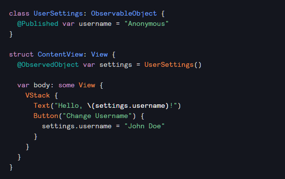
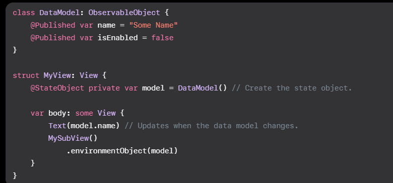

# Swift UI
Everything is a view
1. VStack and HStack to organize UI elements
2. 'Modifiers' wrap elements in a view
3. SwiftUI has a maximum of 10 views on a page - extract view to make a smaller one
4. Add color in assets and symbols using SF symbols

Common Views that will be used all the time:
- Text, Image 

Common modifiers:
- .backgroundColor, .foregroundColor, .front, .frame (width and height)

## Data passing in SwiftUI
1. Passing of data based on state using @State 
   1. Exampole of declarative programming - the UI will react to the change in state
   2. The @State tells Xcode to maintain state even though it destroys and recreates the view
2. @Bindings allows @State to be passed down to children and maintain the same value we pass down $<binding value>
3. If too many depth then use environment

### Additional Creating a data model to change the app 

XCode beta - SwiftUI - Keep up with the documentation also deprecated things will eventually break the code in the future..

1. @Binding is only required if we need write access. Otherwise we can pass down the variable down directly.
2. @Published: Used to denote an observable object that automatically announces when a change occus
3. @EnvironmentObject: A property wrapper for an observable object that a parent of ancestore view supplies (up the chain); That is to say a protocol swiftUI supplies for  objects that can be observed for changes. Usually paired with @Publishished; Any property marked with @Published will automcally notify UI for changes - used for SceneDelegate  In this example any changes to settings.username will reflect to observers; the exmaple above the content view is observing the settings observable object in the Text Field.
Clicking the button will change the name and refresh the page
5. @StateObject: A property wrapper that instatiates an observable object 

a single state of truth

5. What is the difference between @StateObject and @ObservedObject?  
Ownership. They are almost exactly the same; expect the rule is the view who first creates the object must use @StateObject, and thus swift knows who is responsible for keeping it alive; while all other views must use @ObservedObejct
6. If we need a convnient object that can be accessed through the application itself which wrapper would we use? 
@EnvironmentObject

## Important Objects:
1. SceneDelegate - Responsible for managing a single instance of apps UI. This means each window or scene has its own scene delegate

~Download The Anki day1~ 