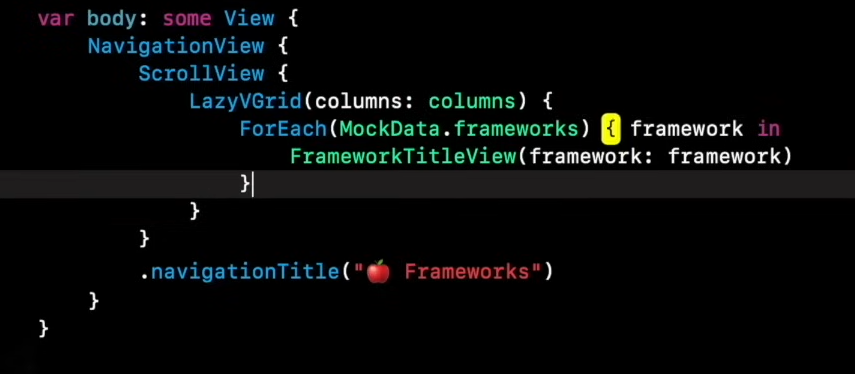
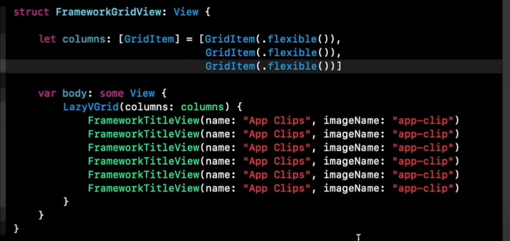
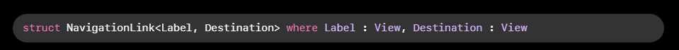

# SwiftUI View methods and Navigation
methods acting on views

1. .popup : presents a popup or banner based on a condition `isPresented`
2. .badge : Allows us to modify the small text 

### Stacks
- VStack: Alligns Views verticly in a column
- HStack: Alligns Views in a horizontal line row
- ZStack: Alligns Views on top of eachother

### Other View
- List
- Grid : LazyVGrid and LazyHGrid (this means the views get initiated as they are needed)
- ScrollViews : Usually placed in VGrid to allow scrolling

Grid views need a template that is `column : [GridItem] = [GridItem(.flexible())]`

Loops in SwiftUI we need to have Hashable or 
## Navigation
https://developer.apple.com/documentation/swiftui/navigation
The important things in navigation is the View and also the Link

The NavigationLink can point to the destination view including NavigationView. When the NavigationLink is clicked a View is presenting inside a NavigationStack or NavigationSplitView

NavigationView holds an array of ViewControllers
## Sending HTTP/S and WS/S message through iOS  

Use URLSession