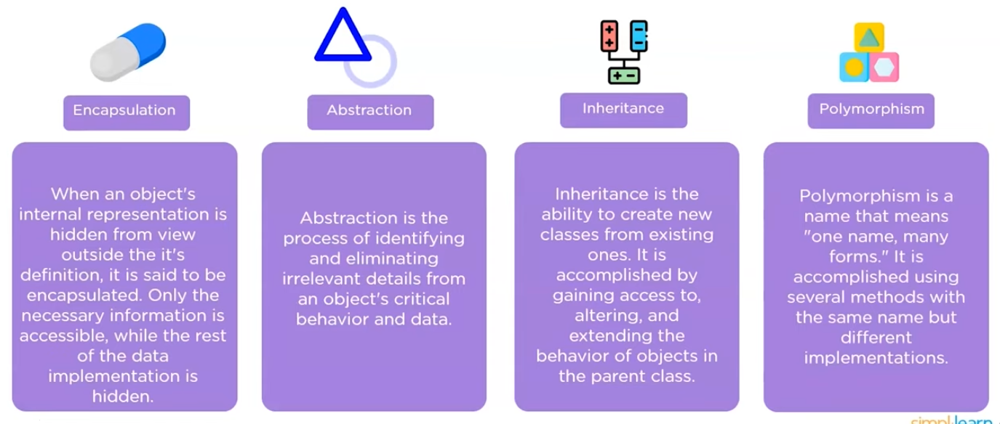

# Mobile Development in Maui

### C# Fundamentals

#### Datatypes
```C#
int
double
bool
char
string
```
#### Structions
1. List: List\<type>
   1. `List<type> l = new List<type>();`
   2. list.add()
   3. list.pop()

```C#
Create list of n elements:
List<int> l = Enumerable.Repeat(0, n).ToList();

Add an item and remove:
l.Add(5)
l.Remove(0)

Sort an array:
l.Sort().Reverse() (reverses the array)

Find an item:
l.contains(element)
```

2. Arrays: int[n] = {}
   1. `int[] array = {}`
3. Dictionaries
   1. `Dictionary<a, b> = new Dictionary<a, b>()`
4. Priority Queue (minheap)
    `using System.Collections.Generic PriorityQueue<int, int> minHeap = new PriorityQueue<int, int>()`
    the priority and the value i.e., the payload

#### Functions:
- static
- private
- public

#### Classes
1. abstract classes and interfaces
   ```C#
   abstract class Animal {
    implementThisMethod()
   }

   interface IAnimal {
    pet()
   }
   ```
Abstract classes are similar to interfaces but they are more 'concrete' since they provide a default implementation of methods. You would use an abstract class when you have a base class that all children should implemenet and it makes sense not to rewrite the base implementation - such as in send HttpsMessage - each class would have a send method that could be shared.

Usefull things:
1. provide shared implementation
2. DRY
3. e.g., Vehicle abstract - car, bus, motorbike all can drive and have a brand

Inteface is more flexible and is usefull for creating groups of unrelated classes. Also known as a contract. Since there are no default implementation, fields or constructors and methods are always public by defualt it is very flexible and not as constricting.

Usefull things:
1. classes can have multiple interfaces
2. loose coupling in application - useful in dependancy injection
3. e.g., A payment processor interface can be inherited by paypal, stripe, credit-card, bitwallet etc., and then the use supplies the processor

Other classes
1. Partial class is defined int multiple files or can be shared
2. Sealed class cannot be inherited - prevent inheritence design
3. Static classes are created in memory - usefull for singleton pattern


Finally structs are like classes except they are passed by value, also they always have public methods and variables cannot manage memory

#### Async/Await and Tasks

```C#
async Task PrintMessage() {
    await Task.Delay(1000);
    Console.Writeline("Hello World")
}
```

#### Virtual method and abstract mehtods
- Virtual methods can be overriden by inherited classes
  - They must have an default implementation
- Abstract mehtods do not have a default implementation ovverride is not required


### Common C# Questions
1. Program to reverse a string
   ```C#
    private rev
   ```
#### OOP:
1. Enapsulation 
2. Abstraction 
3. Inheritence 
4. Polymorpism


#### CLR what is it
Manages the execution of .NET program - just in time compiler compiles code into machine instructions. It also exceptions, typesafety and memory managment

## Xamarin + Maui specific

Model View View Model - 
View Model contains properties to bind to
View is in XAML which binds to the viewmodel

